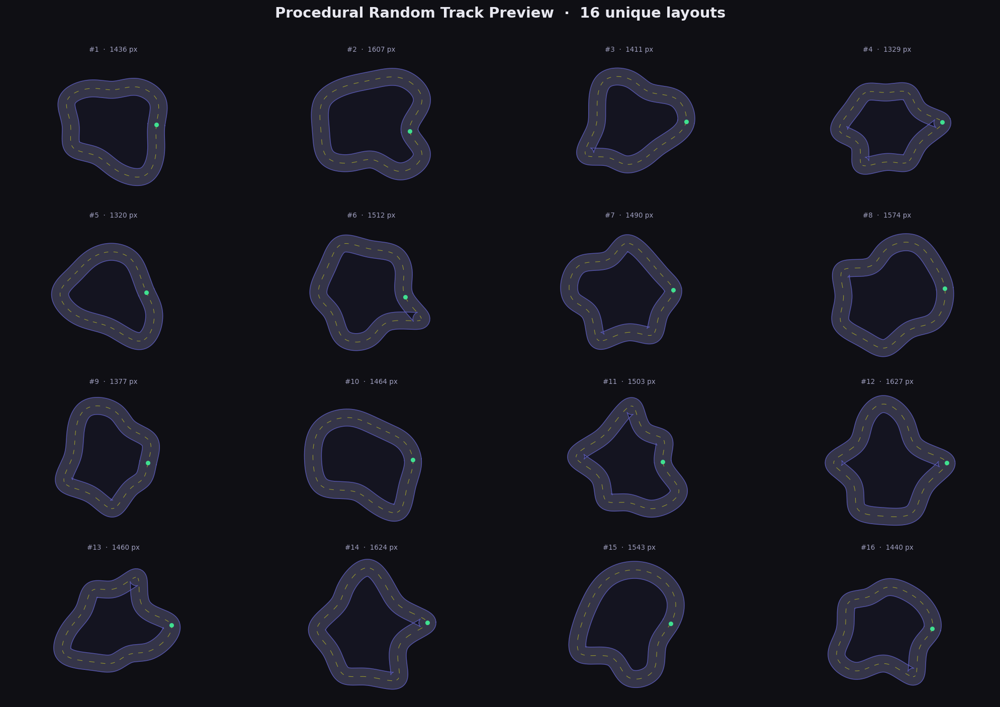
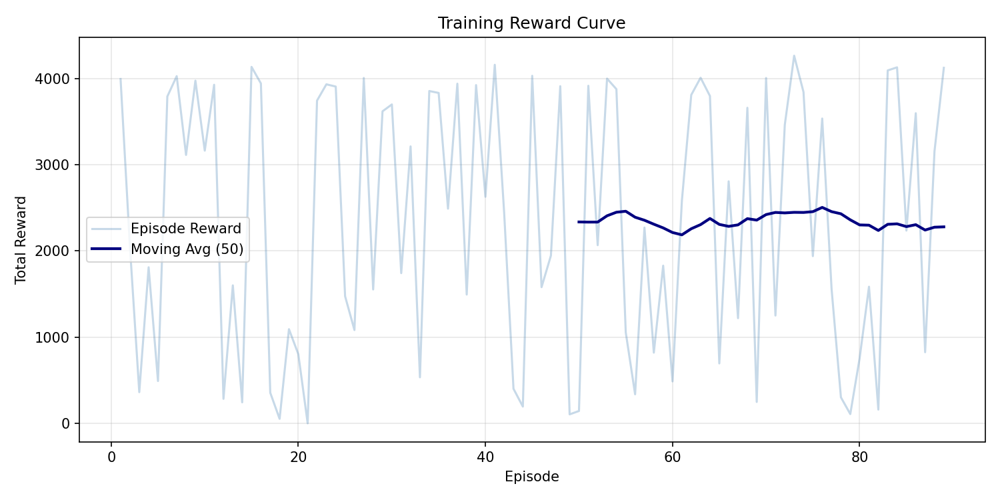

# Self-Driving Car with Actor-Critic Reinforcement Learning

This project trains and demos a 2D self-driving car in a top-down track environment built with `pygame` and `pytorch`. The agent uses continuous steering and throttle control, ray-cast distance sensors, a policy network for action selection, and a value network for trajectory-based actor-critic updates with generalized advantage estimation.

The repository currently includes trained checkpoints in `checkpoints/` and `checkpoints/best/`, so demo mode can be run directly after installing dependencies.

## Overview

The system consists of:

- a procedural closed-track environment with inner and outer road boundaries
- a simple car dynamics model with speed, heading, steering, and friction
- a ray-based sensor model that measures normalized distances to nearby walls
- an actor network that outputs a Gaussian action distribution
- a critic network that predicts state values
- a training loop that collects full trajectories and updates the model with GAE

## Project Layout

```text
self_driving_ac/
|-- main.py
|-- config.py
|-- requirements.txt
|-- README.md
|-- capture_episodes.py
|-- track_preview.py
|-- train_100.py
|-- test_smoke.py
|-- test_train.py
|-- checkpoints/
|   |-- actor.pt
|   |-- critic.pt
|   |-- reward_curve.png
|   |-- loss_curves.png
|   |-- track_preview.png
|   `-- best/
|       |-- actor.pt
|       `-- critic.pt
|-- env/
|-- models/
|-- rl/
`-- utils/
```

## Features

- continuous control with action vector `[steering, throttle]`
- stochastic policy during training and deterministic policy during demo
- procedural random track generation using periodic splines
- vectorized sensor-wall intersection checks
- trajectory-based actor-critic training with generalized advantage estimation
- checkpoint saving for latest and best-performing models
- saved training curves and track preview figures

## Environment and Model

### Observation Space

Each observation has dimension `num_sensors + 4`. With the default config, that is `9 + 4 = 13`.

The observation vector contains:

1. normalized sensor distances
2. normalized speed
3. heading relative to road direction
4. normalized lateral offset from the centerline
5. normalized angular velocity

### Action Space

The action has dimension `2`:

- `steering` in `[-1, 1]`
- `throttle` in `[0, 1]`

### Default Training Configuration

Key values from `config.py`:

- actor learning rate: `3e-4`
- critic learning rate: `1e-3`
- gamma: `0.99`
- gae lambda: `0.95`
- hidden size: `128`
- sensors: `9`
- sensor spread: `180` degrees
- max episode steps: `3000`
- training episodes: `5000`
- random track generation: enabled

## Included Figures

### Procedural Track Samples



### Training Reward Curve



These are repository artifacts. They are useful for documentation and quick inspection, but they are not required to run training or demo mode.

## Requirements

### Software

- python `3.10` or newer is recommended
- `pip`
- a desktop environment for `pygame` demo rendering

### Python Dependencies

Install from `requirements.txt`:

- `torch>=2.0.0`
- `pygame>=2.5.0`
- `numpy>=1.24.0`
- `matplotlib>=3.7.0`
- `scipy>=1.10.0`

Optional:

- `pillow` is needed only for `capture_episodes.py`

## Setup

Run all commands from inside the `self_driving_ac` directory. The code imports modules such as `config`, `env`, and `rl` relative to that directory.

### Clone and Enter the Project

```bash
git clone <your-repo-url>
cd <repo-name>/self_driving_ac
```

### Create a Virtual Environment

#### Windows PowerShell

```powershell
python -m venv .venv
.\.venv\Scripts\Activate.ps1
```

#### Linux or macOS

```bash
python3 -m venv .venv
source .venv/bin/activate
```

### Install Dependencies

```bash
pip install -r requirements.txt
```

If you want to generate episode GIFs:

```bash
pip install pillow
```

## Running the Project

### Run Demo Mode with the Included Checkpoints

If `checkpoints/best/actor.pt` exists, `main.py` automatically prefers that checkpoint. If not, it falls back to `checkpoints/actor.pt`.

```bash
python main.py --mode demo
```

To stop the demo:

- press `q`
- or close the `pygame` window

### Train from Scratch

```bash
python main.py --mode train
```

### Train Without Rendering

This is typically faster.

```bash
python main.py --mode train --no-render
```

### Resume Training from an Existing Checkpoint

```bash
python main.py --mode train --resume
```

### Train for a Specific Number of Episodes

```bash
python main.py --mode train --episodes 1000
```

### Use a Custom Checkpoint Directory

```bash
python main.py --mode train --checkpoint-dir checkpoints_experiment_1
python main.py --mode demo --checkpoint-dir checkpoints_experiment_1
```

## Command Reference

```text
python main.py --mode train
python main.py --mode train --no-render
python main.py --mode train --resume
python main.py --mode train --episodes 1000
python main.py --mode train --checkpoint-dir checkpoints_experiment_1
python main.py --mode demo
python main.py --mode demo --checkpoint-dir checkpoints_experiment_1
```

## Helper Scripts

### Quick 100-Episode Rendered Run

Runs a shorter visible training session with a 30 FPS cap.

```bash
python train_100.py
```

### Generate a Procedural Track Preview Figure

Writes `checkpoints/track_preview.png`.

```bash
python track_preview.py
```

### Capture Episode Frames and Build a Track Variation GIF

This is optional and requires `pillow`.

```bash
pip install pillow
python capture_episodes.py
```

Outputs:

- `checkpoints/episode_frames/`
- `checkpoints/track_variation.gif`

## Tests and Verification

### Smoke Test

This checks environment setup, action selection, update flow, and checkpoint save/load.

```bash
python test_smoke.py
```

### Short Training Pipeline Test

This runs a small headless training job for 5 episodes.

```bash
python test_train.py
```

## Outputs

During or after training, the project writes artifacts under the checkpoint directory:

- `actor.pt`
- `critic.pt`
- `actor_opt.pt`
- `critic_opt.pt`
- `best/actor.pt`
- `best/critic.pt`
- `reward_curve.png`
- `loss_curves.png`

## How Demo Checkpoint Loading Works

When you run:

```bash
python main.py --mode demo
```

the loader checks in this order:

1. `checkpoints/best/actor.pt`
2. `checkpoints/actor.pt`

If neither exists, demo mode exits and asks you to train first.

## Notes for Sharing on GitHub

If you want other people to run the demo immediately after cloning, keep these files in the repository:

- `requirements.txt`
- `main.py`
- the full source tree under `env/`, `models/`, `rl/`, and `utils/`
- `checkpoints/best/actor.pt`
- `checkpoints/best/critic.pt`

Including the optimizer checkpoints is useful for resuming training, but not strictly required for demo mode.

## Troubleshooting

### `ModuleNotFoundError` for `config` or `env`

You are probably running commands from the wrong directory. Enter `self_driving_ac/` first, then run the command again.

### Demo does not start because no checkpoint is found

Either:

- keep the included checkpoint files in `checkpoints/`
- or train a model first with `python main.py --mode train`

### `pygame` window issues in a headless environment

Use headless tests or training without rendering:

```bash
python test_smoke.py
python test_train.py
python main.py --mode train --no-render
```

### `scipy` installation fails

Make sure your Python version is supported by available wheels for your platform, then retry installation inside a fresh virtual environment.

## Customization

Most project settings live in `config.py`, including:

- learning rates
- reward weights
- number of sensors
- track generation parameters
- rendering and FPS limits
- checkpoint settings

If you want to experiment, `config.py` is the first place to change.

## Summary

This repository is already set up for both training and direct demo use. If the dependencies are installed and the bundled checkpoints remain in `checkpoints/`, the shortest working path is:

```bash
cd self_driving_ac
pip install -r requirements.txt
python main.py --mode demo
```
